```{r setup, include=FALSE}
options(htmltools.dir.version = FALSE)
```
background-image: url(https://upload.wikimedia.org/wikipedia/commons/c/c1/Rlogo.png)
???

Image credit: [Wikimedia Commons](https://commons.wikimedia.org/wiki/File:Rlogo.png)
---

class: inverse, middle

Hi, Welcome to the **<span style="color:#00B2EE">'Build your website using R, RStudio and blogdown package'</span>** workshop.

I'm Tanja! A Data Scientist at [DataTeka](https://datateka.com/). A year ago I quit my job in academia and moved to Belgrade to play a part in establishing data science in the Balkan region. Recently, I started an initiatve <span style="color:#00B2EE">`klikR`</span> for introducing Data Science through R to youngsters as their possible career option. [klikR's](http://klikr.rbind.io) website is created using <span style="color:#00B2EE">`blogdown`</span> 😃.  
 

The goal of our workshop is to work through the material and to lern how to use [blogdown](https://cran.r-project.org/web/packages/blogdown/index.html) package to make a web site.

---
class: inverse, middle
Go to <https://github.com/DataTeka/NWUnisRDay> to download the material.

```{r, out.width = "550px", fig.align = 'center', echo=FALSE}
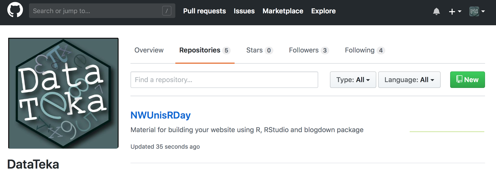
```

```{r, out.width = "550px", fig.align = 'center', echo=FALSE}
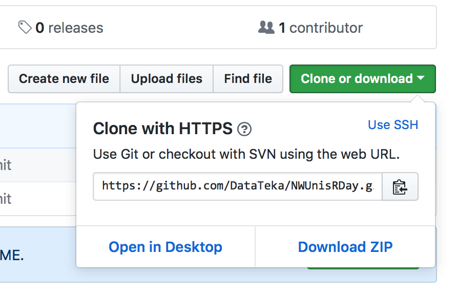
```
---
class: inverse, center, middle

#Get Started 🤫😴
```{r, out.width = "600px", echo=FALSE}

```

---
class: center, middle

```{r, out.width = "600px", echo=FALSE}
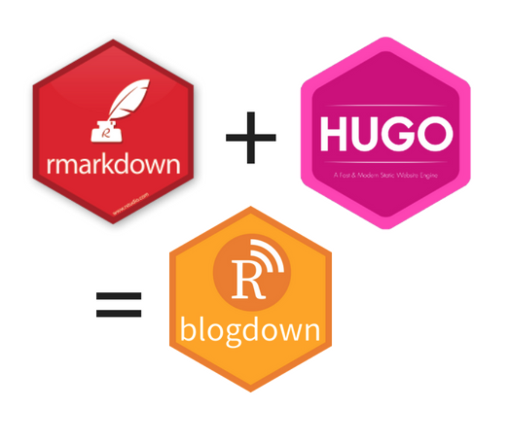
```

---
## So what is blogdown?<sup>*</sup>
- [R Markdown](https://rmarkdown.rstudio.com) 
    - (relatively) simple syntax for writing documents
    
    - the simpler, the more portable (multiple output formats)
    
    - not only convenient (maintenance), but also reproducible
    
    - most features of R Markdown _and_ [**bookdown**](https://bookdown.org) (technical writing)!!

--

- [Hugo](https://gohugo.io) 

    - free, open-source, and easy to install (a single binary)
    
    - lightning fast (generates one page in one millisecond)
    
    - general-purpose (not only for blogs)

.footnote[
[\*] From Yihui: https://slides.yihui.name/2017-rmarkdown-UNL-Yihui-Xie.html#35.
]

---
## Why not WordPress, Tumblr, Medium.com, Blogger.com, etc?<sup>*</sup>
- No R Markdown support (even math support is often nonexistent or awkward)

--

- Huge benefits of static websites compared to dynamic websites
    - all static files, no PHP or databases, no login/password, work everywhere (even offline)
    
    - typically fast to visit (no computation needed on the server side), and easy to speed up via CDN
.footnote[
[\*] From Yihui: https://slides.yihui.name/2017-rmarkdown-UNL-Yihui-Xie.html#36.
]

---
class: inverse, center, middle

# Let us start practicing Elain's Dance!!! 😃🎵🎶
```{r, out.width = "300px", fig.align = 'center', echo=FALSE}

```

---
## Prep with GitHub

The workshop will not go through [Happy Git with R](http://happygitwithr.com) to connect RStudio with your GitHub account.


We are going to assume that you are already familiar and have done:

☑️ Capter 5: [Register a GitHub account ](http://happygitwithr.com/github-acct.html)

☑️ Chapter 6: [Install or upgrade R and RStudio ](http://happygitwithr.com/install-r-rstudio.html)

---
Go to your GitHub account and create a new repository
```{r, out.width = "200px", fig.align = 'right', echo=FALSE}
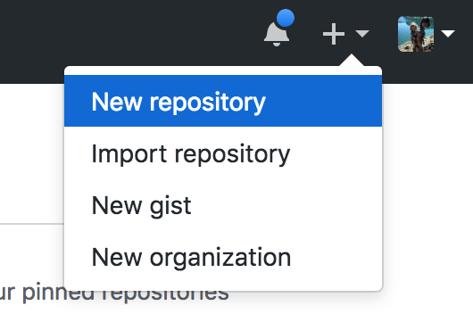
```

Give a meaningful name 
```{r, out.width = "300px", fig.align = 'center', echo=FALSE}
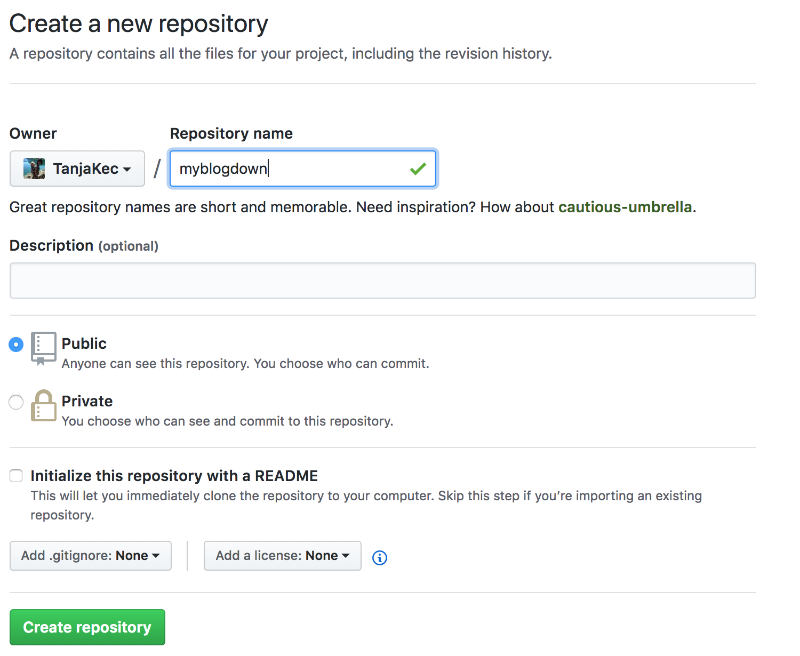
```

Copy repo's **HTTPS** address
```{r, out.width = "350px", fig.align = 'center', echo=FALSE}
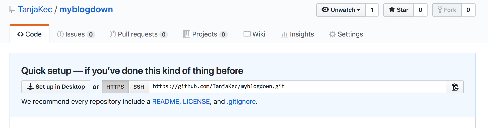
```

---
Open a new project in RStudio: **File** ➡️ **New Project...**
```{r, out.width = "250px", fig.align = 'center', echo=FALSE}
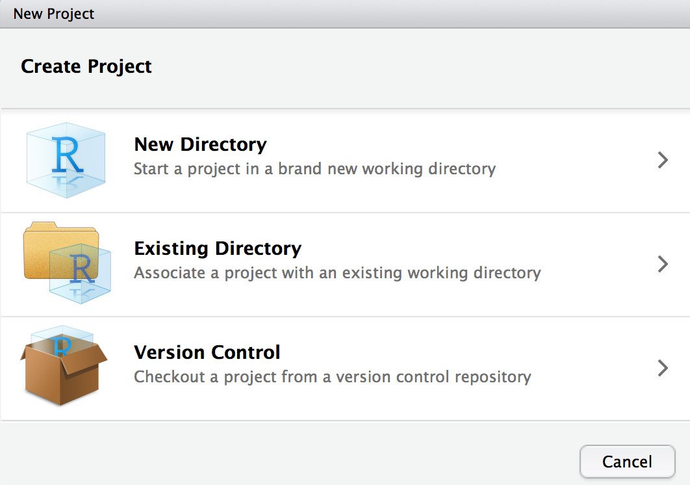
```
Select **Version Control** ➡️ **Git**
```{r, out.width = "250px", fig.align = 'center', echo=FALSE}
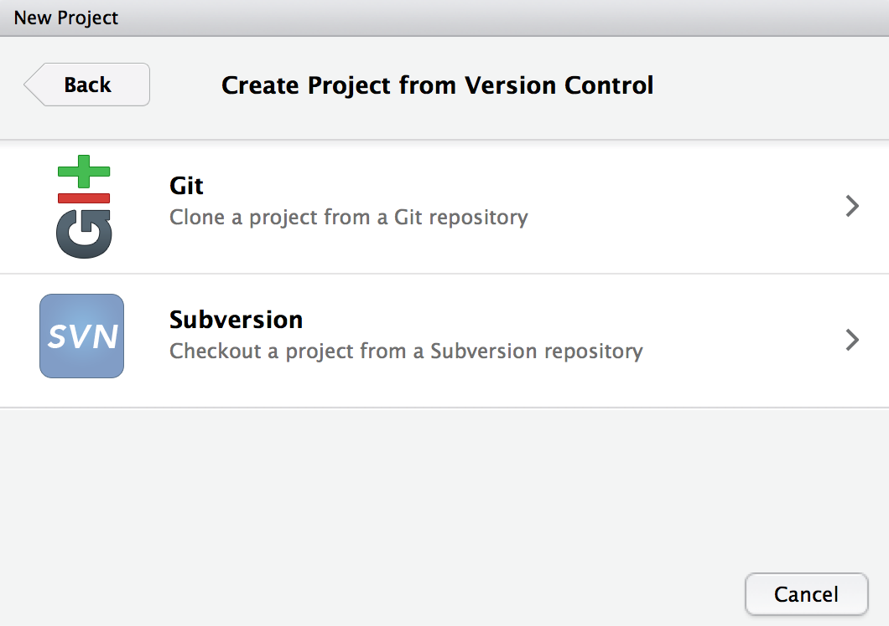
```

Paste the address of your Git repo  
```{r, out.width = "250px", fig.align = 'center', echo=FALSE}
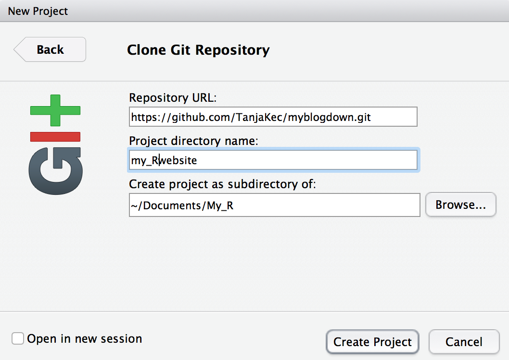
```

---
## Install the packages

Install <span style="color:#EEAD0E">`blogdown`</span>*</sup>

```{r eval=FALSE}
install.packages("blogdown")
```

Install <span style="color:#EE1289">`Hugo`</span> using blogdown
```{r eval=FALSE}
blogdown::install_hugo()
```

If you already got those packages installed you can chech to update your <span style="color:#EE1289">`Hugo`</span> package
```{r eval=FALSE}
blogdown::hugo_version() # check version
blogdown::update_hugo() # force an update
``` 
 
.footnote[
[\*] If you having trouble installing the package try:

`install.packages("blogdown", repos = "http://cran.us.r-project.org")`.🤞
]

---
class: inverse, center, middle
# Let's build a website...

```{r, out.width = "250px", echo=FALSE, fig.align = 'center'}
knitr::include_graphics("images/Cosmo.jpg")
```

---
##Build a website

We'll adopt *simple is beautiful* approch and start building a website using a `default theme`*</sup>.

```{r eval=FALSE}
blogdown::new_site()
```

To use a different theme (for example: `hugo-academic`):

```{r eval=FALSE}
blogdown::new_site(theme = "gcushen/hugo-academic", 
                   theme_example = TRUE)
```

To see the current **Hugo themes** go to <https://themes.gohugo.io/>.

.footnote[
[\*]Let the knowledge and familiarity with `blogdown` and `Hugo` grow first.🧐 Once you get familiour with `blogdown` and `Hugo` you can always swich to a different theme. 💇
https://bookdown.org/yihui/blogdown/other-themes.html
]

---
###Structure of a HUGO site
.pull-left[
```{r, out.width = "200px", fig.align = 'center', echo=FALSE}
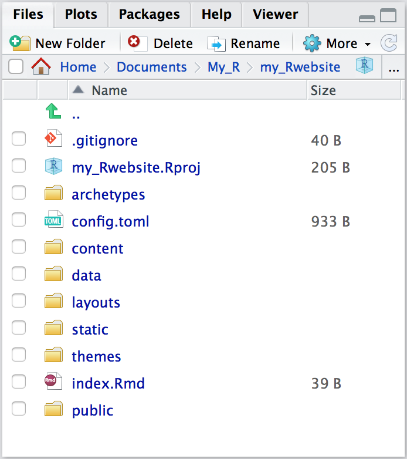
```
]
.pull-right[
```{r, out.width = "200px", fig.align = 'center', echo=FALSE}
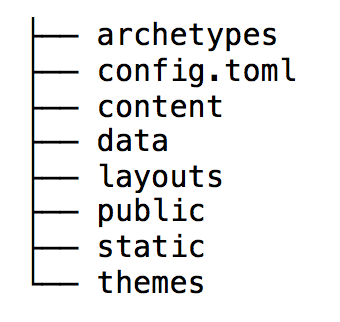
```
]

<https://gohugo.io/getting-started/directory-structure/>

Note which folders are empty at the top level of your project:
```{r, out.width = "200px", fig.align = 'center', echo=FALSE}
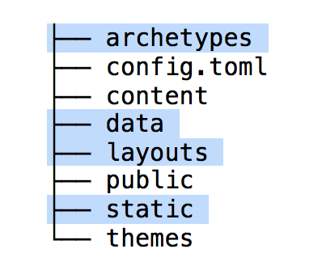
```
<https://gohugo.io/themes/theme-components/>

---
### Serve site

In console type:
```{r eval=FALSE}
blogdown::serve_site()
```

or, from `Addins` menue select `servesite` 

```{r, out.width = "200px", fig.align = 'center', echo=FALSE}
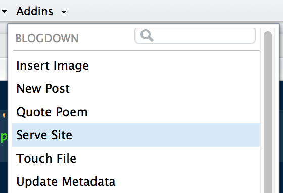
```

Don't try to view your site in your teeny RStudio viewer, instead click on <span style="color:#00B2EE">`Show in new window`</span>.

```{r, out.width = "250px", fig.align = 'center', echo=FALSE}
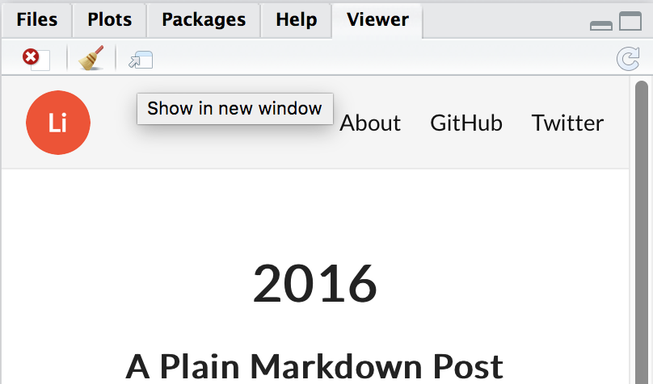
```

---
### Notation we will adopt

- **Trailing slash** will indicate a directory name, e.g. `content/` means we are refering to a directory called *content*, not to a file named *content*.

```{r, out.width = "150px", fig.align = 'center', echo=FALSE}
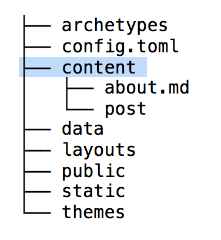
```

- **Leading slash** indicate the root directory of your *project website*, e.g. `/content/about.md` means we are refering to `about.md` file which is under the root directory of the website project.  

```{r, out.width = "150px", fig.align = 'center', echo=FALSE}
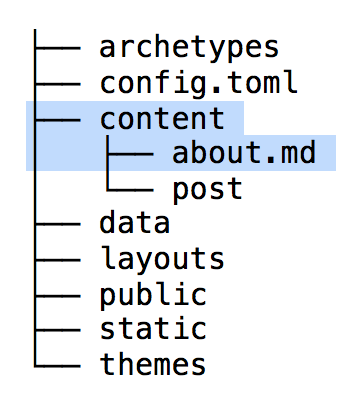
```

---
class: inverse, center, middle
# Let's edit our website...


---
class: inverse, center, middle
#Step 1: logo 🛠⚙️💡

---
###<span style="color:#00B2EE">Step 1:</span> add a logo
```{r, out.width = "80px", fig.align = 'left', echo=FALSE}
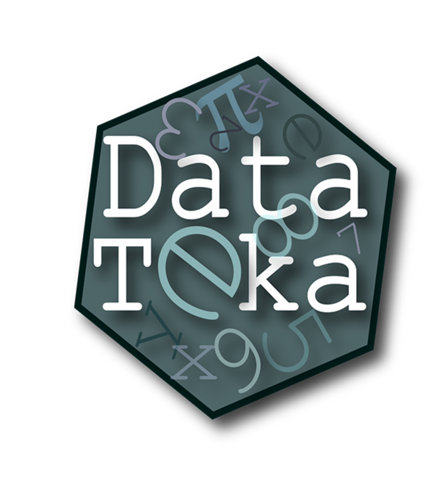
```
The logo file belongs in the `/static/` directory:
> `/static/` stores all the static content for your future website: images, CSS, JavaScript, etc. When Hugo builds your site, all assets inside your static directory are copied over as-is.

<https://gohugo.io/getting-started/directory-structure/>

1. Move `01-images` folder to `/static/`

2. Rename folder `images` (so now you have a `static/images/` folder with 2 .png files in it)

3. Update <span style="color:#EE2C2C">`config.toml`</span> and save
```{r, out.width = "250px", fig.align = 'left', echo=FALSE}
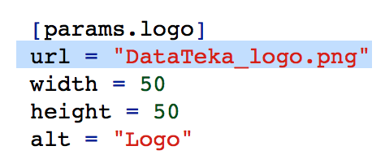
```
---
###<span style="color:#104E8B">Step 1:</span> we've got a logo! 

```{r, out.width = "800px", fig.align = 'center', echo=FALSE}
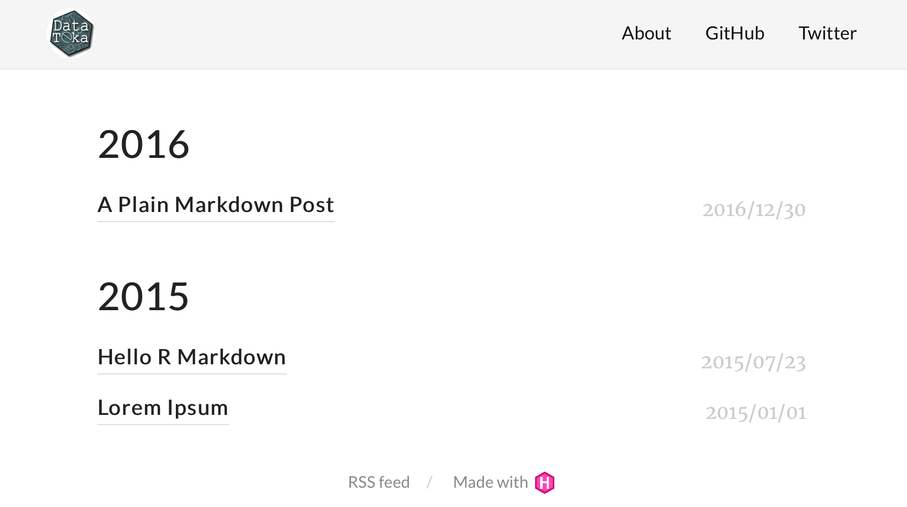
```
---
###<span style="color:#4A708B")>Step 1:</span> we've learnt 🥁🎺😎

`/themes/<THEME>/static/images/logo.png` 

can be overwritten by 

`/static/images/<DataTeka_logo.png>`

.pull-left[
```{r, out.width = "200px", fig.align = 'center', echo=FALSE}
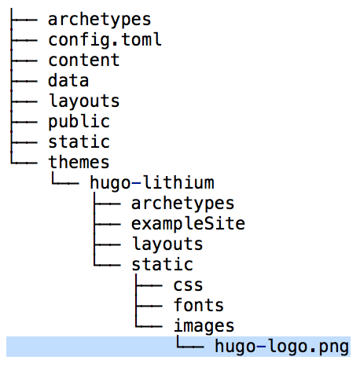
```
]

.pull-right[
```{r, out.width = "200px", fig.align = 'center', echo=FALSE}
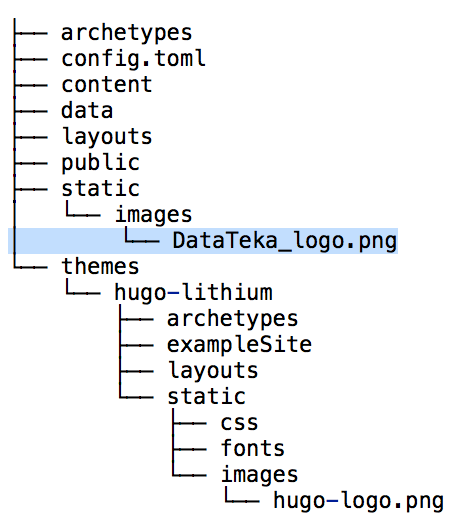
```
]

.footnote[
Note that this would work only with Hugo templates that have 'standard' Hugo folder structure.💡
]
---

class: inverse, center, middle
#Step 2: about 🛠⚙️💡
---
###<span style="color:#00B2EE">Step 2:</span> update the *about* page

1. Move `02-about.md` file to `/content/`

2. Delete the existing file `about.md`

3. Rename `2-about.md` → `about.md`
---

###<span style="color:#104E8B">Step 2:</span> we've got a logo! 

```{r, out.width = "800px", fig.align = 'center', echo=FALSE}
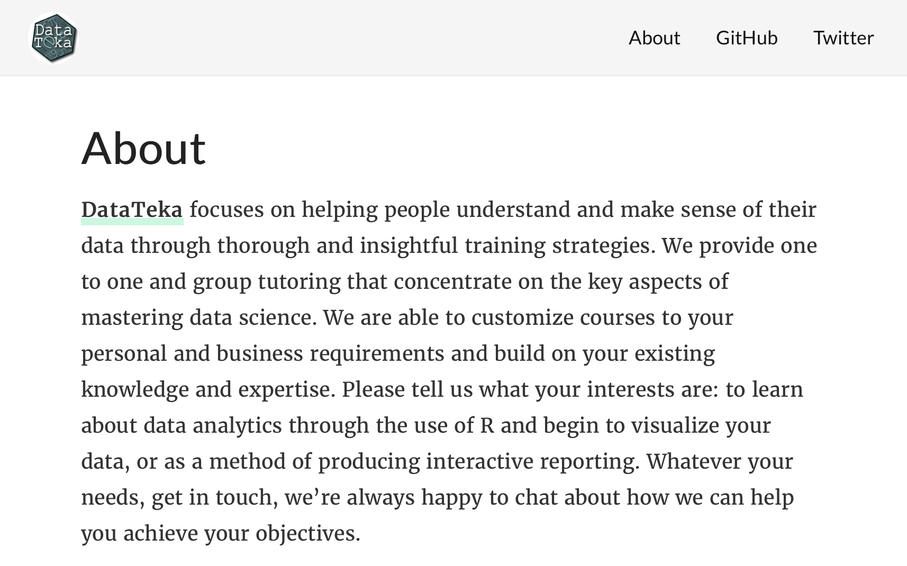
```
---

###<span style="color:#4A708B")>Step 2:</span> we've learnt 🥁🎺😎

>All `content` for your website will live inside this directory. Each top-level folder in Hugo is considered a content section. For example, if your website has two main sections *posts* and *about* page, there will be a directorie at `content/posts` and a file `content/about.md`.

<https://gohugo.io/getting-started/directory-structure/>

```{r, out.width = "200px", fig.align = 'center', echo=FALSE}
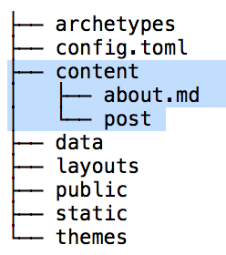
```
---
class: inverse, center, middle
#Step 3: emojis 🛠⚙️💡
---
###<span style="color:#00B2EE">Step 3:</span> enable the emojis 😁🤷🤦

Note the amendments you need to do to the top of your `config.toml` file.  

```{r, out.width = "600px", fig.align = 'center', echo=FALSE}
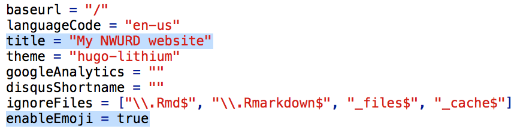
```

Save the change and check the *about* page... it should show a ❤️

---
###<span style="color:#4A708B")>Step 3:</span> we've learnt 🥁🎺😎

> In your `config` file, you can direct Hugo as to how you want your website rendered, control your website’s menus, and arbitrarily define site-wide parameters specific to your project.

<https://gohugo.io/getting-started/configuration/>

---
class: inverse, center, middle
#Step 4: navigation bar 🛠⚙️💡
---
###<span style="color:#00B2EE">Step 4:</span> edit your navigation bar

Make the changes to your `config.toml` file:

```{r, out.width = "350px", fig.align = 'left', echo=FALSE}
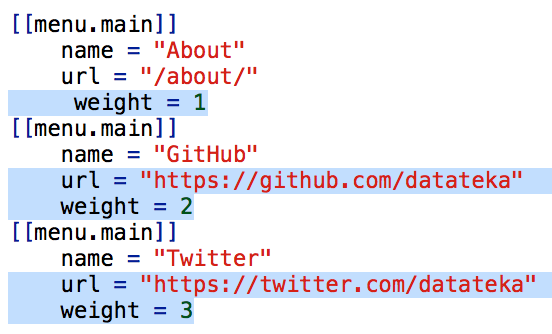
```

Save the changes, Serve Site and check the links.

---
###<span style="color:#4A708B")>Step 4:</span> we've learnt 🥁🎺😎

The `[[menu.main]]` in your `config` file enables you to edit and add navigation options.  

> A menu entry in a menu-template has specific variables and functions to make menu management easier.

<https://gohugo.io/variables/menus/>
---
class: inverse, center, middle

##Are we starting to feel confortable learning Elain's moves?! 😃🎵🎶

```{r, out.width = "300px", echo=FALSE}
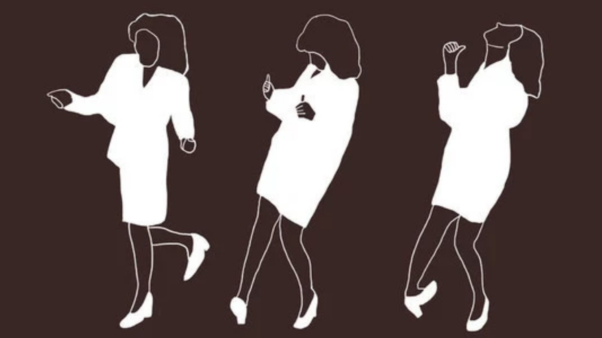
```
---
class: inverse, center, middle
#Step 5: css 🛠⚙️💡
---
###<span style="color:#00B2EE">Step 5:</span> customise the look 💅💄🎨

1) In `/static/` create a new directory `css`

--

2) Move `05-datateka.css` file to `/static/css/`

--

3) Rename `05-datateka.css` --> `datateka.css`

```{r, out.width = "200px", fig.align = 'left', echo=FALSE}
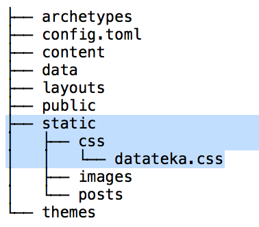
```
--

4) In `config.toml`, add the highlighted line:

```{r, out.width = "500px", fig.align = 'left', echo=FALSE}
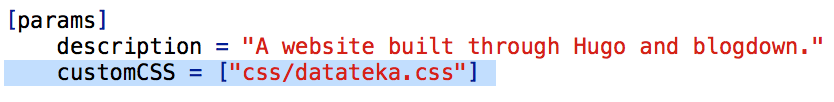
```

---
###<span style="color:#104E8B">Step 5:</span> we've got a look! 
```{r, out.width = "700px", fig.align = 'center', echo=FALSE}
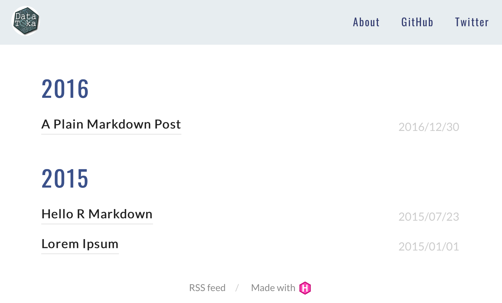
```

---
###<span style="color:#4A708B")>Step 5:</span> we've learnt 🥁🎺😎

We have seen that 

`/themes/<THEME>/static/css/main.css`

could be overwritten by style rules present in:

`/static/<css/datateka.css>`

```{r, out.width = "300px", fig.align = 'center', echo=FALSE}
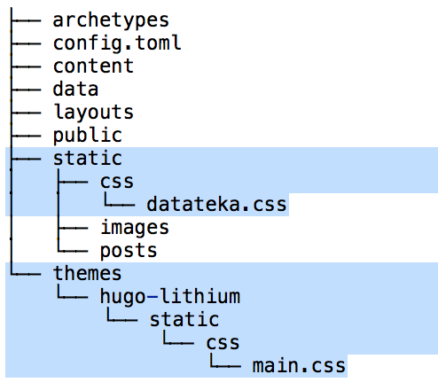
```
---
class: inverse, center, middle
#Step 6: Font Awesome 🛠⚙️💡
---
###<span style="color:#00B2EE">Step 6:</span> use Font Awesome 

> Font Awesome is a font and icon toolkit based on CSS and LESS.

<https://en.wikipedia.org/wiki/Font_Awesome>

Go [here](https://fontawesome.com/v4.7.0/get-started/) to enter your email address and receive a Font Awesome embed code. We'll use the one you've downloaded with the workshop boundle for today's demo.

To use them, you need 2 things:

- the Font Awesome CSS file, and

- a script that directs your site to where the fonts can be found (via Font Awesome's Content Delivery Network, or CDN)


---
###<span style="color:#00B2EE">Step 6:</span> use Font Awesome 

1a) Move 06-font-awesome.min.css to `/static/css/`

2a) Rename `06a-font-awesome.min.css` --> `font-awesome.min.css`

3b) Create a new directory in `layouts/` called `partials`

4b) Move other `06b-head_custom.html` and `06b-nav.html` to `/layouts/partials/` and renamed them by removing `06b-` from the files names.

```{r, out.width = "300px", fig.align = 'center', echo=FALSE}
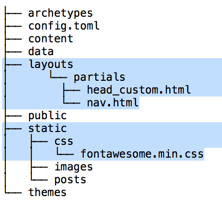
```
---
###<span style="color:#00B2EE">Step 6:</span> use Font Awesome 

Make changes to these sections in your `config.toml`:

```{r, out.width = "700px", fig.align = 'left', echo=FALSE}
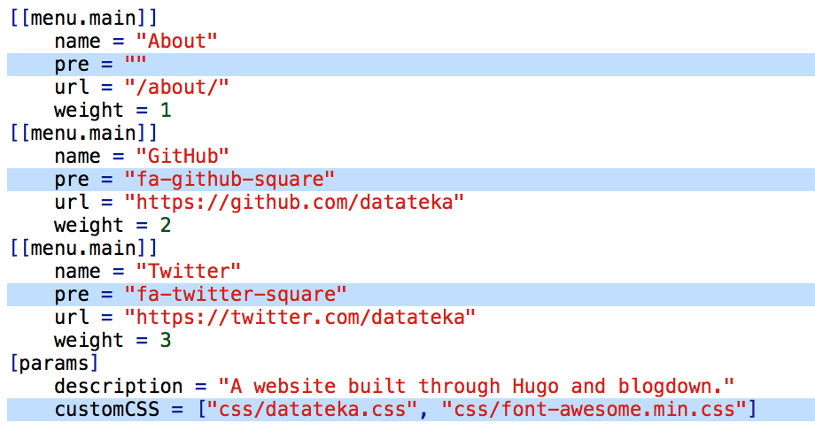
```

---
###<span style="color:#104E8B">Step 6:</span> look at our awesome font and icons! 

```{r, out.width = "700px", fig.align = 'center', echo=FALSE}
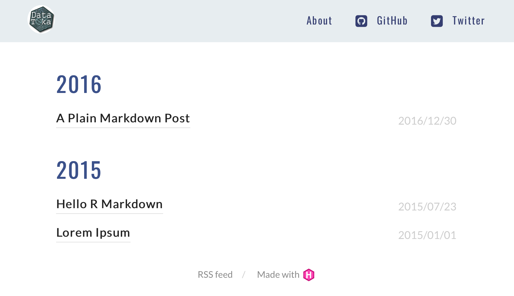
```

---
###<span style="color:#4A708B")>Step 6:</span> we've learnt 🥁🎺😎

`/themes/<THEME>/layouts/partials/*<PARTIALNAME>.html`

Could be overwritten by:

`/layouts/partials/*<PARTIALNAME>.html`

The `<PARTIALNAME>`s must match; unless you want to edit how the partials are called within your templates:

  `{{ partial "<PATH>/<PARTIAL>.html" .  }}`
  
https://gohugo.io/templates/partials/

```{r, out.width = "250px", fig.align = 'left', echo=FALSE}
knitr::include_graphics("images/learn_structure_fontawsome.png")
```
---
class: inverse, center, middle
#Step 7: homepage 🛠⚙️💡
---
###<span style="color:#00B2EE">Step 7:</span> create a homepage 

Where to move the file `07-index.html`?

1) Move `07-index.html` to `/layouts/`<sup>*</sup> 

2) Rename `07-index.html` to `index.html`

3) Edit the `config.toml` file

```{r, out.width = "600px", fig.align = 'left', echo=FALSE}
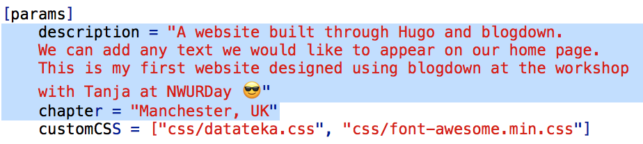
```

.footnote[
[*] NOT to /layouts/partials/
]

---
###<span style="color:#104E8B">Step 7:</span> look at our home page! 

```{r, out.width = "600px", fig.align = 'center', echo=FALSE}
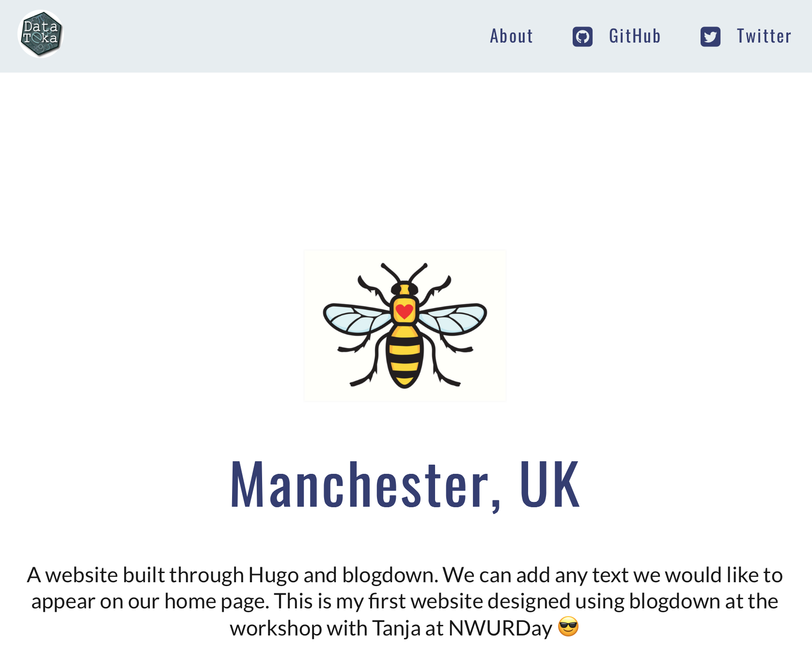
```

---
###<span style="color:#4A708B")>Step 7:</span> we've learnt 🥁🎺😎

Even when there is no `index.html` file here:
 
`/themes/<THEME>/layouts/index.html`

--

We can make one that serves as the homepage here:

`/layouts/index.html`

```{r, out.width = "200px", fig.align = 'center', echo=FALSE}
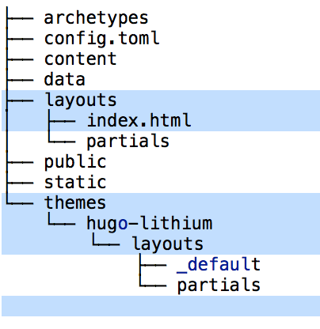
```

--

The filename `index.html` has special status in Hugo, and is **not** a partial layout template.

You could also force a homepage by creating an `_index.md` file that lives at the root of your `/content/` folder (i.e., `/content/_index.md`)

<https://gohugo.io/templates/homepage/>
---
class: inverse, center, middle
#Step 8: posts 🛠⚙️💡
---
###<span style="color:#00B2EE">Step 8:</span> adding a post 

Add a post section to your navigation bar by adding the highlighted lines to your `config.toml` file.  

```{r, out.width = "400px", fig.align = 'left', echo=FALSE}
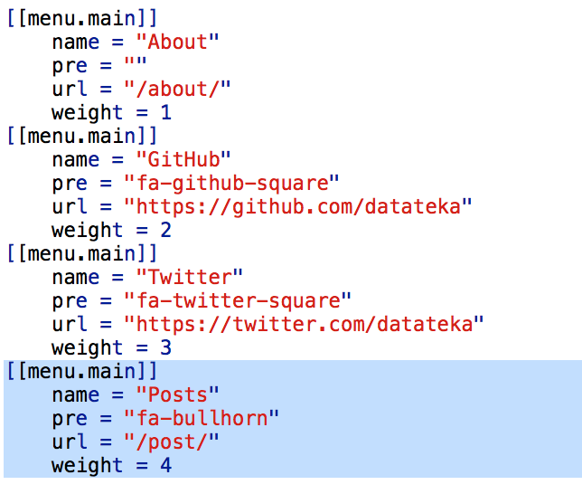
```
---
###<span style="color:#104E8B">Step 8:</span> we've got a link for the posts!


```{r, out.width = "600px", fig.align = 'center', echo=FALSE}
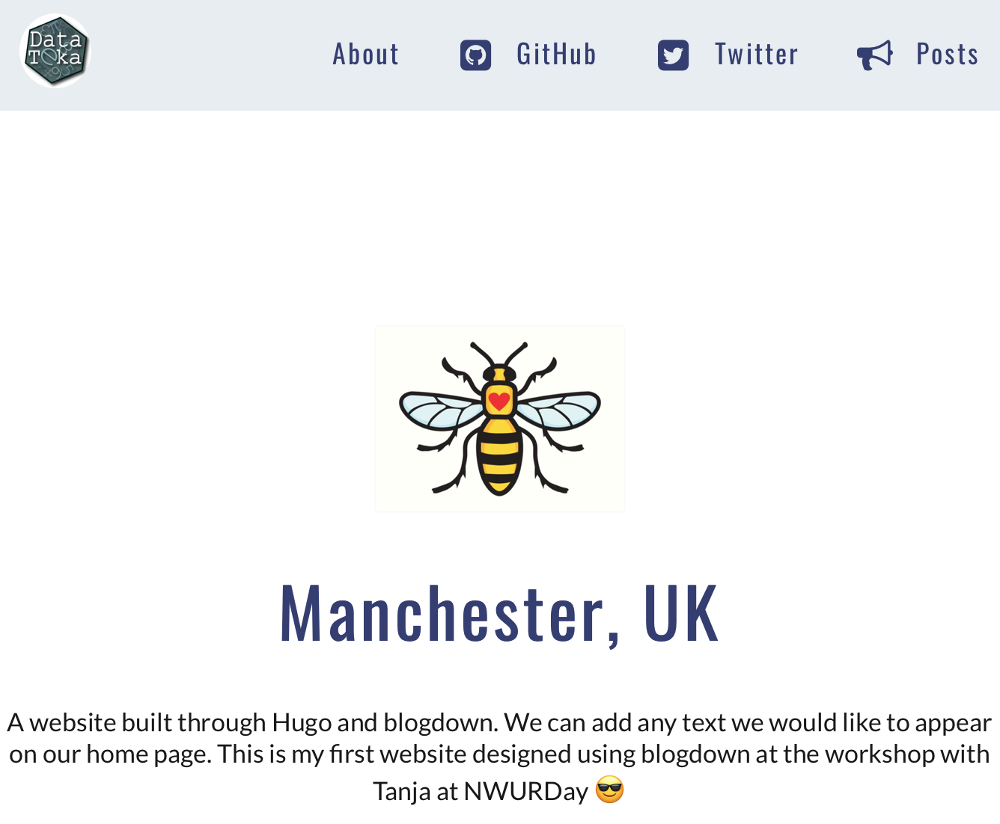
```
---
###<span style="color:#00B2EE">Step 8:</span> write a post ✍️
Go to `Addins` and select `New Post` to which you are going to add the properties
.pull-left[
```{r, out.width = "200px", fig.align = 'center', echo=FALSE}
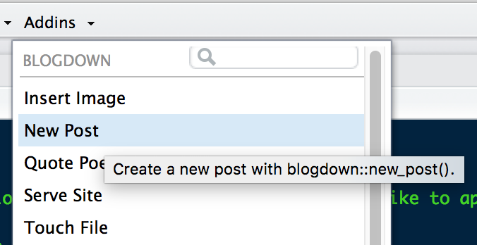
```
]
.pull-right[
```{r, out.width = "275px", fig.align = 'center', echo=FALSE}
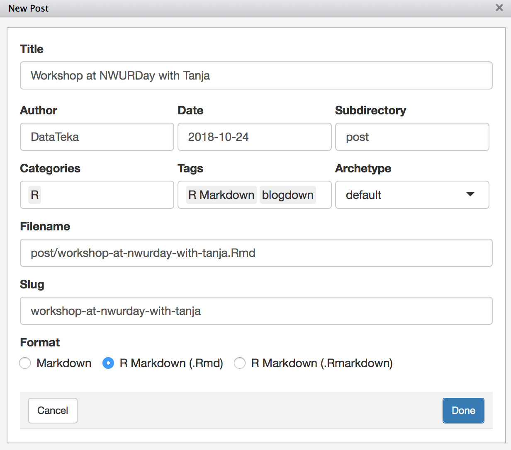
```
]

You can start writting your post as an R Markdown file 😊
```{r, out.width = "250px", fig.align = 'center', echo=FALSE}
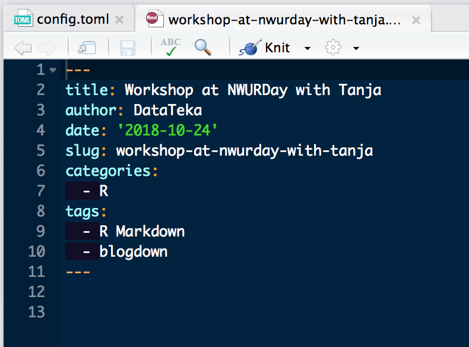
```

---
###<span style="color:#104E8B">Step 8:</span> we've got our first posts!

```{r, out.width = "600px", fig.align = 'center', echo=FALSE}
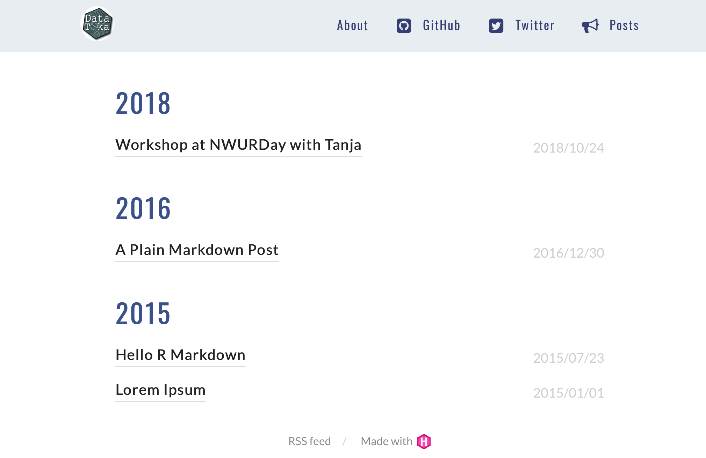
```

---
###<span style="color:#00B2EE">Step 8:</span> removing the `default` posts 🤷

Click on the `Files` tab and navigate to `/content/posts/` directory to get the list of the *posts files*

--

Select the once you don't want and click on `Delete` ❌. 

```{r, out.width = "300px", fig.align = 'center', echo=FALSE}
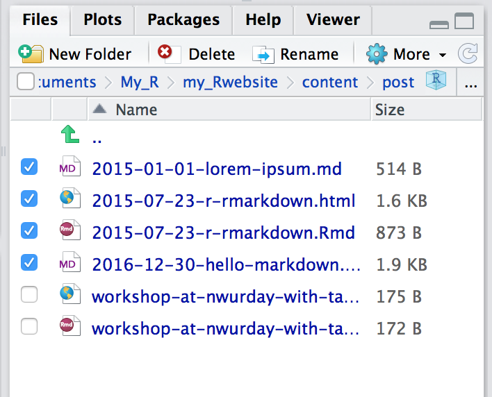
```

--

`Serve Site` to have a look
```{r eval=FALSE}
blogdown::serve_site()
```

---
###<span style="color:#104E8B">Step 8:</span> look at your posts!

```{r, out.width = "700px", fig.align = 'center', echo=FALSE}
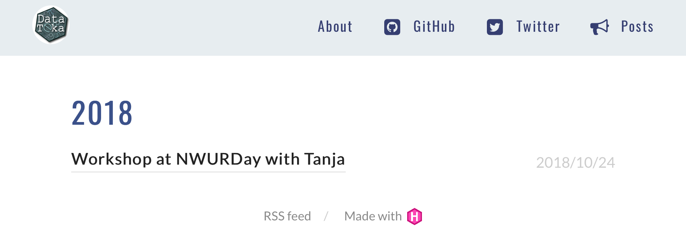
```
---
###<span style="color:#4A708B")>Step 8:</span> we've learnt 🥁🎺😎

Adding a post is easy by selection the option `New Post` from the `Addins` drop-down menu and writing it as a `.Rmd` file. This file will be authomaticaly placed inside `/content/posts/` directory.

`/content/posts/workshop-at-nwurday-with-tanja.Rmd`

```{r, out.width = "400px", fig.align = 'left', echo=FALSE}
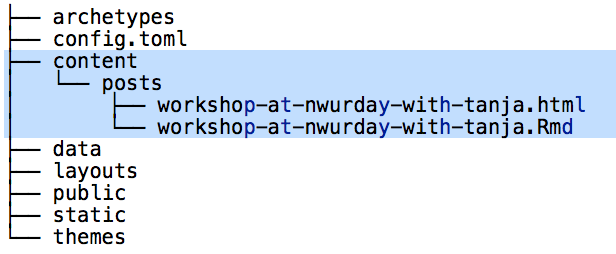
```
---
class: inverse, center, middle

##Let's do Elain's Dance!!! 😃🎵🎶

```{r, out.width = "500px", echo=FALSE}

```
---

class: inverse, center, middle

# Deploy your website 🧞

---
### Deployment

Click on the `Git` tab and select all of the files to `commit`

```{r, out.width = "350px", fig.align = 'left', echo=FALSE}
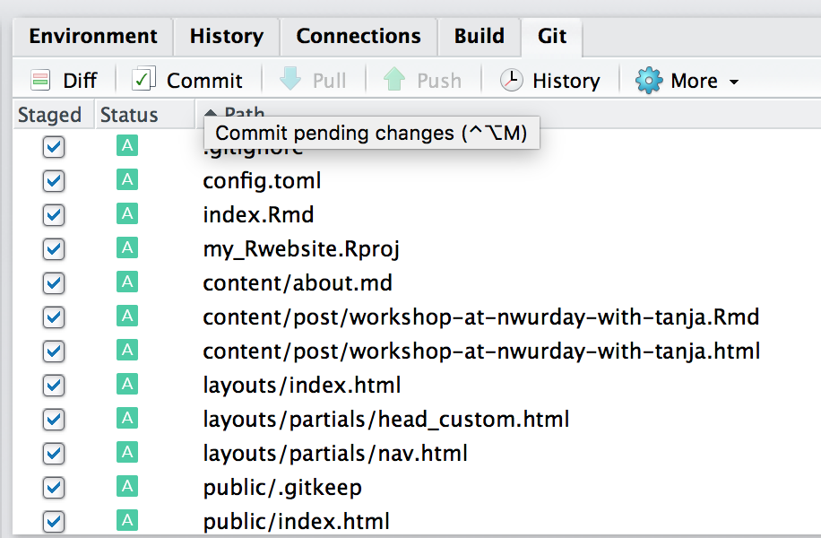
```

```{r, out.width = "600px", fig.align = 'left', echo=FALSE}
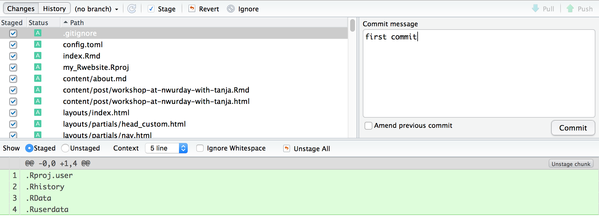
```
---

Click to `push`

```{r, out.width = "700px", fig.align = 'left', echo=FALSE}
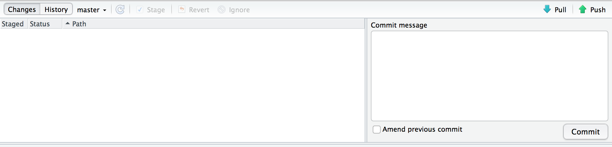
```

```{r, out.width = "500px", fig.align = 'left', echo=FALSE}
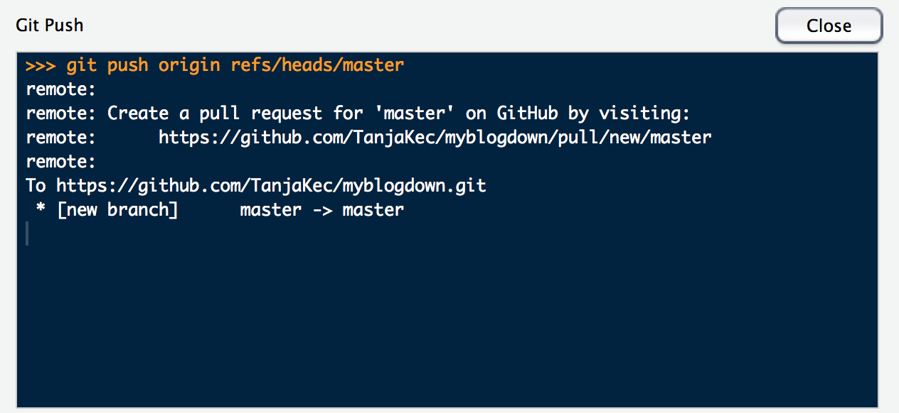
```
---
### Check your Git Repo

```{r, out.width = "750px", fig.align = 'center', echo=FALSE}
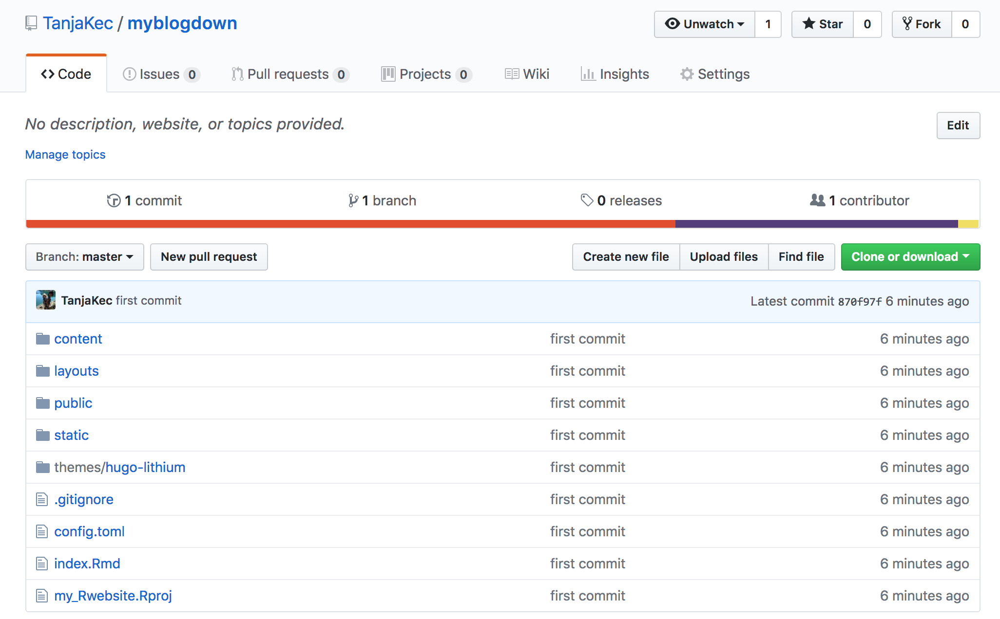
```
---
class: inverse, center, middle

###Congratulations! You are a step away from making your website up and running!!!! 👍😃

```{r, out.width = "300px", echo=FALSE}

```
---
### Have you heard about [Netlify](https://www.netlify.com/)?

```{r, out.width = "250px", fig.align = 'center', echo=FALSE}
knitr::include_graphics("images/yuhui_xie.png")
```

> Consider Netlify instead of GitHub Pages for Your Static Websites.

> Do not use Github pages or the *.github.io subdomain. Use Netlify instead. Netlify is the new and much better Github pages.

*Yihui Xie*

<https://yihui.name/en/2017/06/netlify-instead-of-github-pages/>
---

```{r, out.width = "700px", fig.align = 'center', echo=FALSE}
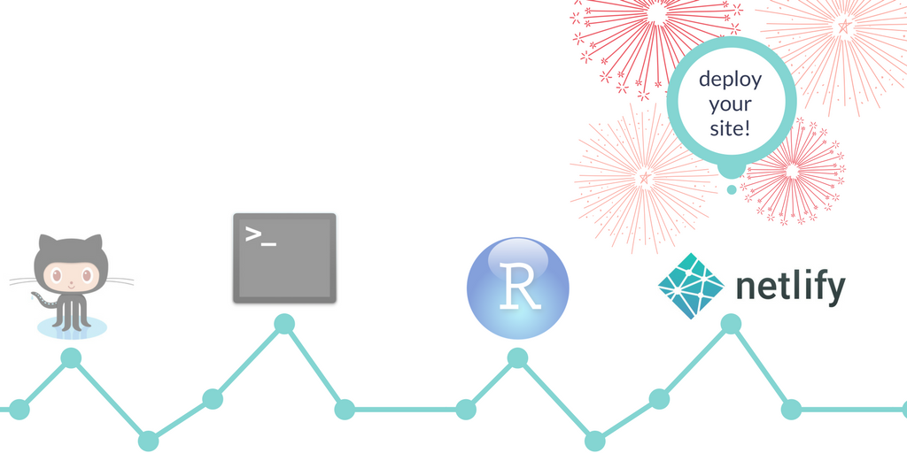
```

> Deploying in Netlify through GitHub is smooth.

> When you are ready to deploy, commit your changes and push to [GitHub](https://github.com), then go online to [Netlify](https://www.netlify.com/).

*Alison Presmanes Hill*

<https://alison.rbind.io/post/up-and-running-with-blogdown/>
---
Go to [Netlify](https://www.netlify.com/) and open an account (the esiest is by using your [GitHub](https://github.com) login).

Click on *New site from Git* button

```{r, out.width = "400px", fig.align = 'center', echo=FALSE}
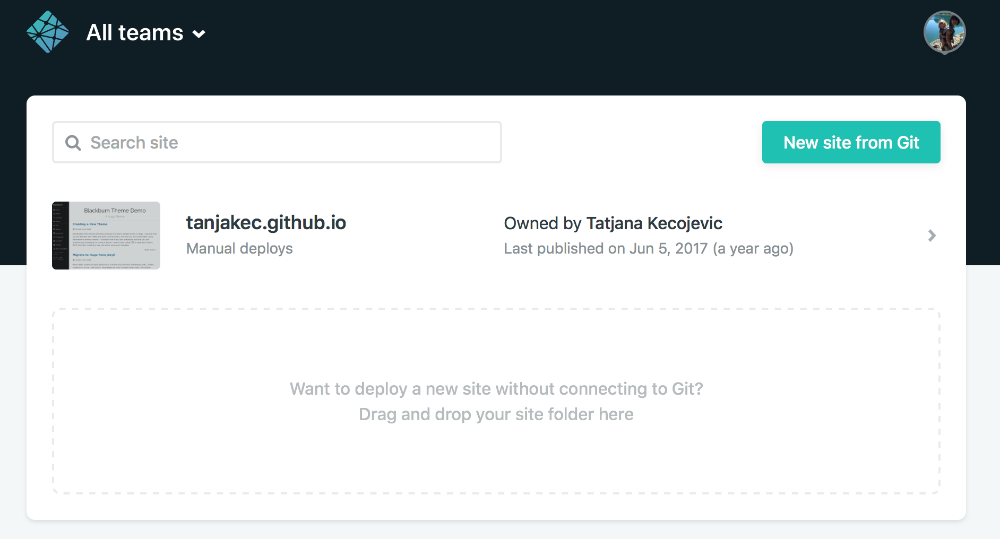
```

--

Select *GitHub* option to *Continue Deployment*.

```{r, out.width = "400px", fig.align = 'center', echo=FALSE}
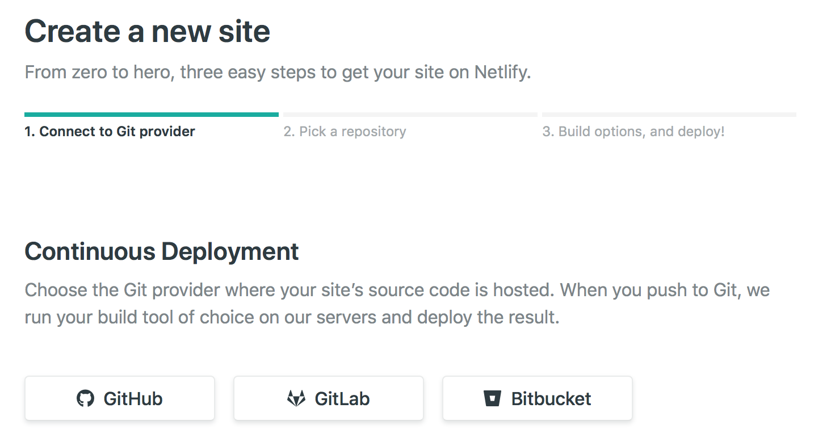
```

---
Selct your site repo and klick on *Deploy site* button at the bottom of the page.

```{r, out.width = "700px", fig.align = 'center', echo=FALSE}
knitr::include_graphics("images/deploy_site.png")
```
---
Go into *Site Setting* and click on *Change site name*. 

```{r, out.width = "700px", fig.align = 'center', echo=FALSE}
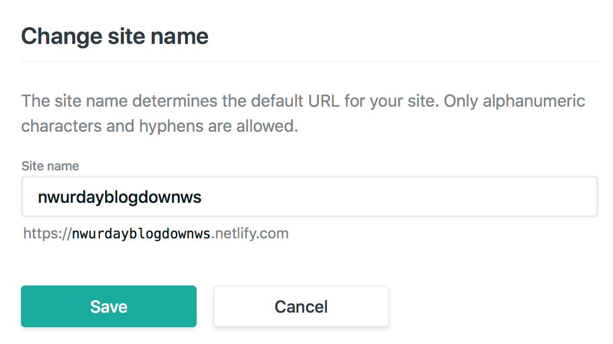
```
---
```{r, out.width = "700px", fig.align = 'center', echo=FALSE}
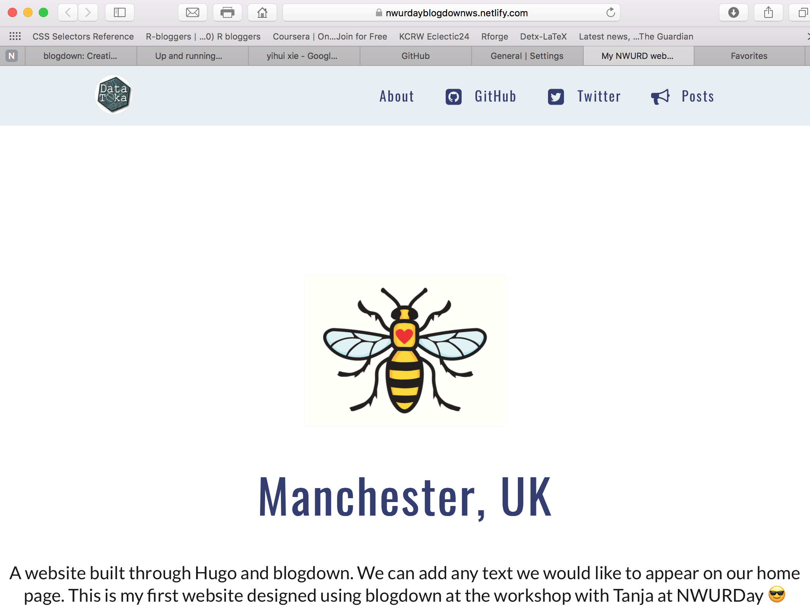
```
---
### You can hoste your site as `rbind` subdomain 
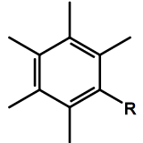
[rbind](https://github.com/rbind) - Bind all websites in the `R` and `stats` community. 
    

<http://klikr.rbind.io> is an example of what to request if you wish to move your site to [rbind](https://github.com/rbind).    
```{r, out.width = "500px", fig.align = 'center', echo=FALSE}
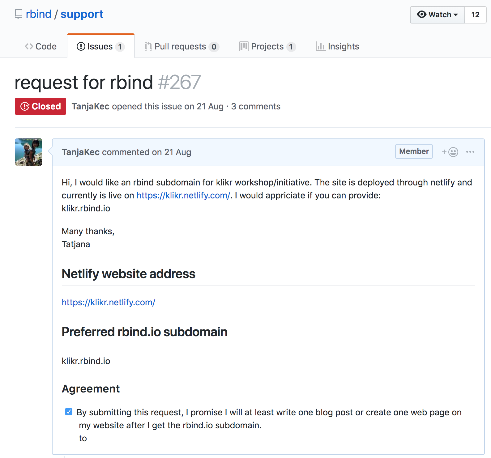
```    
---
### Final step: update `baseurl` in your `config.toml`
```{r, out.width = "500px", fig.align = 'center', echo=FALSE}
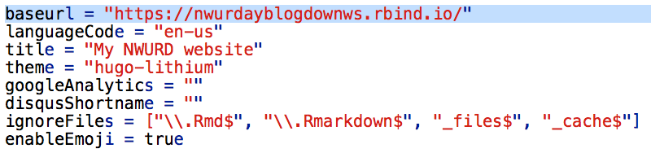
```

On [Netlify](https://www.netlify.com/), go into *Domain settings -> Custom domain* and update

```{r, out.width = "500px", fig.align = 'center', echo=FALSE}
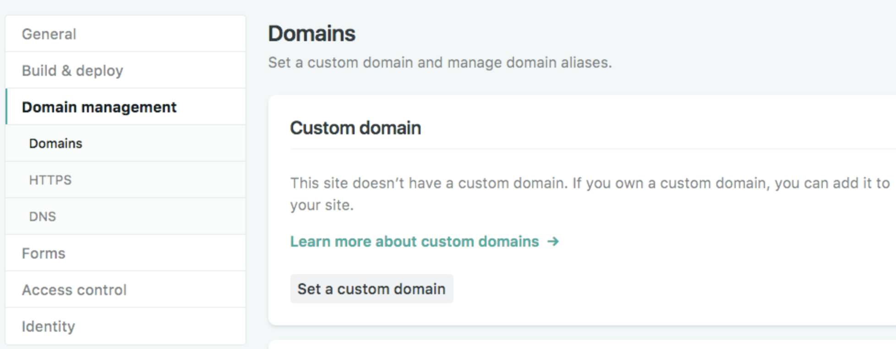
```

<https://support.rbind.io/about/>
---

### Some useful links

[RStudio: Making websites with Markdown](https://www.rstudio.com/resources/webinars/introducing-blogdown/)

A tutorial on using `blogdown`.

--

<https://blogdown-demo.netlify.com> GitHub: <https://github.com/apreshill/blogdown-demo>

A minimal website example using blogdown site by [Alison Presmanes Hill](https://alison.rbind.io).

--
[Up and running with blogdown](https://alison.rbind.io/post/up-and-running-with-blogdown/#build-your-site-in-rstudio)

[Alison's](https://amber.rbind.io/) well structurd and easy to follow tutorial higlighting the key steps when building a weisite using blogdown.

--

[`blogdown`: Creating Websites with R Markdown](https://bookdown.org/yihui/blogdown/) 

by [Yihui Xie](https://yihui.name/), [Amber Thomas](https://amber.rbind.io/), [Alison Presmanes Hill](https://alison.rbind.io)
---

class: inverse, center, middle
##Do the Cosmo Dance?! 🤪🎵🎶
```{r, out.width = "500px", echo=FALSE}
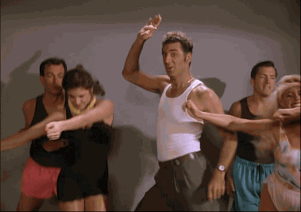
```

---
class: center, middle

##Thanks!

To Yihui and RStudio for the blogdown package

To the rbind group for support

Special thanks to Alison for sharing her knowledge and making her material reproducable and freely available. This workshop has been created with Alison's support and it is based on her 'up and running with blogdown tutorial' available at <https://github.com/apreshill/blogdown-workshop>

Please provide a feedback by filling the form:

<https://datateka.shinyapps.io/NURDay_Form>

[www.datateka.com](www.datateka.com) 

[tanjakec.github.io](tanjakec.github.io)

@DataTeka 

@Tatjana_Kec


Slides created via `R` package [**xaringan**](https://github.com/yihui/xaringan).

The chakra comes from [remark.js](https://remarkjs.com), [**knitr**](http://yihui.name/knitr), and [R Markdown](https://rmarkdown.rstudio.com).

